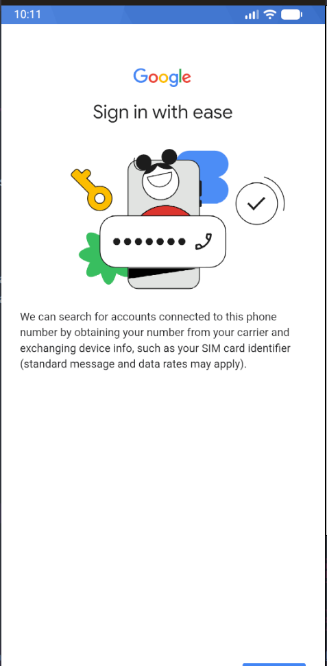
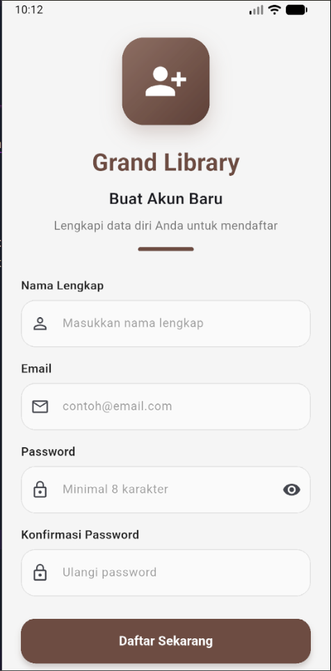
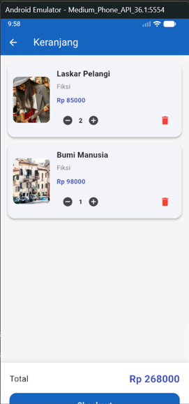
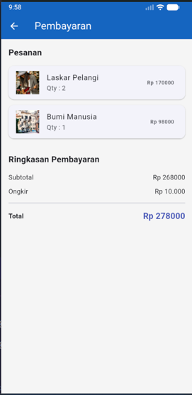

# Todo App

# Overview

**GrandLib** adalah aplikasi toko buku digital yang dirancang untuk memberikan pengalaman berbelanja buku secara praktis dan efisien. Melalui aplikasi ini, pengguna dapat menjelajahi koleksi buku, memilih buku yang diinginkan, menambahkannya ke keranjang, serta melakukan proses checkout dengan mudah.

Aplikasi ini memiliki antarmuka yang sederhana dan intuitif sehingga memudahkan pengguna dalam mencari serta membeli buku favorit mereka.

## Fitur Utama

- **Katalog Buku**
  Menampilkan daftar buku lengkap beserta informasi seperti judul, penulis, harga, dan deskripsi singkat.

- **Keranjang Pesanan**
  Pengguna dapat menambahkan beberapa buku ke dalam keranjang, mengubah jumlah pesanan, menghapus buku, serta melihat total harga sebelum melakukan pembelian.

- **Checkout**
  Memungkinkan pengguna untuk meninjau kembali pesanan, melihat total pembayaran, dan menyelesaikan proses pembelian dengan cepat.

## Tujuan Aplikasi

GrandLib dikembangkan untuk memberikan solusi belanja buku secara digital dengan proses yang cepat, mudah, dan nyaman. Dengan adanya fitur katalog buku, keranjang pesanan, dan checkout, pengguna dapat mengelola pembelian buku secara efisien dalam satu aplikasi.

## Instalasi

https://github.com/harlyimans/UAS_Harlyimans_Grandlib

## Screenshot

1. Login 

2. Login Google

3. Register

4. dashboard

5. Keranjang

6. Checkout

## Author

Harly Imans Setiadi
